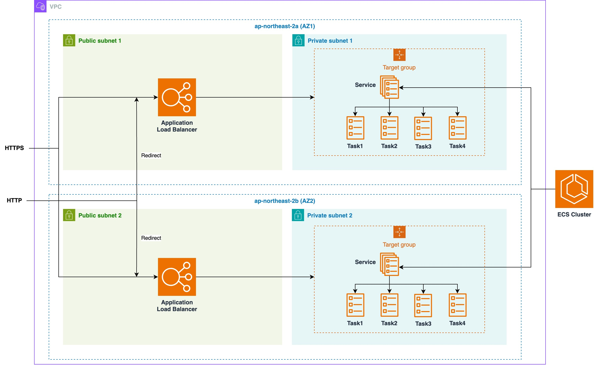
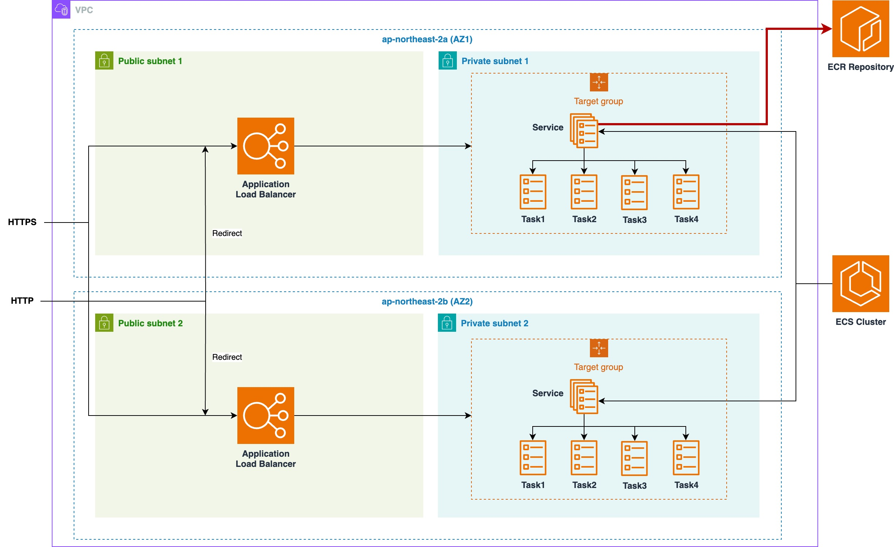
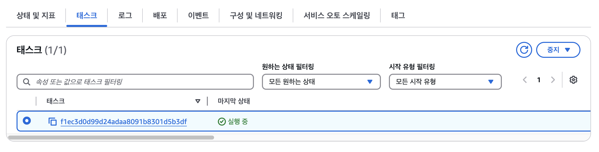

# sam-templates-ecs-private

이 프로젝트는 AWS 플랫폼에서 Private subnet에 ECS Fargate 서비스를 배포하던 중 겪은 Troubleshooting에 대한 회고이다. 그 내용은 해당 방법과 SAM(CloudFormation) 템플릿 예시를 다룬다.

## Summary

- AWS 내 레거시 프로젝트의 EC2 기반 모놀리식 아키텍처를 MSA 구조로 개선하는 도중 ECS 서비스가 ECR과의 네트워크 연결이 되지 않아 VPC Endpoint PrivateLink 기술을 사용해 연결을 성공하였다. NAT 혹은 Public IP 할당처럼, Private subnet 서비스를 노출하는 방법은 전혀 사용하지 않았다.

  .jpg>)

- VPC Endpoint PrivateLink 설정: 핵심 외 설정은 생략하였다. 자세한 내용은 아래 내용 혹은 Repository의 templates를 참고한다.
  ```yaml
  EcrApiEndpoint:
    Type: AWS::EC2::VPCEndpoint
    Properties:
      VpcEndpointType: Interface
      PrivateDnsEnabled: true
      SubnetIds:
        - !Ref PrivateSubnetOne
        - !Ref PrivateSubnetTwo # 두 Private Subnet으로부터,
      SecurityGroupIds:
        - !Ref SecurityGroupPrivateLink
      ServiceName: !Sub com.amazonaws.${AWS::Region}.ecr.api # ECR을 향한 엔드포인트를 생성한다
  ```
- ECS 서비스의 보안 그룹 설정: 마찬가지로 핵심 외 설정은 생략하였다.

  ```yaml
  ECSService:
    Type: AWS::ECS::Service
    Properties:
      NetworkConfiguration:
        AwsvpcConfiguration:
          AssignPublicIp: DISABLED
          SecurityGroups:
            - !Ref SecurityGroupService
          Subnets: !Ref PrivateSubnetIds

  SecurityGroupService:
    Type: AWS::EC2::SecurityGroup
    Properties:
      GroupDescription: Security group for service

  PrivateLinkIngressFromService:
    Type: AWS::EC2::SecurityGroupIngress
    Properties:
      GroupId: !Ref SecurityGroupPrivateLink
      IpProtocol: -1
      SourceSecurityGroupId: !Ref SecurityGroupService # VPC Endpoint에 서비스 인바운드를 허용한다
  ```

- 이는 다음 SAM CLI 명령어 한번이면 배포 완료이다.
  ```sh
  sam deploy \
    --template-file sam.yaml \
    --stack-name test-stack \
    --capabilities CAPABILITY_IAM \
    --parameter-overrides ImageUri=<Repository URI> \
    --resolve-s3
  ```

## 배경

### 신규 배포와 수정 시에, "콘솔"은 더 이상 편리하지 않게 됨

점점 AWS 콘솔 사용이 익숙해지고 수정 작업이 반복됨에 따라, 마우스를 활용하는 GUI 콘솔이 점점 불편해지는 것을 느꼈다. 그래서 찾은 것이 CloudFormation과 SAM. AWS 자격 시험 때 공부한 이후로 본격적으로 사용해본적이 없어 이번 기회에 CLI에 익숙해지고 DevOps의 더 깊은 경험을 하고 싶었다.

차이점은 바로 여기에 있다. EC2의 새 인스턴스를 생성했다가 수정하고, 삭제한다고 해보자.

#### Console

1. 콘솔 로그인
2. EC2 메뉴
3. 인스턴스 시작
4. OS 및 인스턴스 유형, 리소스 설정
5. 인스턴스 시작 대기
6. 접속
7. 이후 인스턴스 수정을 위해 EC2 메뉴 재진입
8. 인스턴스 수정
9. 재시작해야하면, 다시 인스턴스 재시작 대기
10. 이후 인스턴스 삭제를 위해 EC2 메뉴 재진입
11. 인스턴스 삭제

반복 작업과 마우스 클릭의 피로가 벌써부터 전해진다. 게다가 브라우저를 이용한 콘솔은 로딩 부하가 존재한다(느리다).

#### CLI & CloudFormation

이를 개선하기 위해 AWS CLI를 사용한다. CLI와 CloudFormation을 사용하면 콘솔 반복 작업을 반자동화 혹은 자동화할 수 있다.

1. YAML 템플릿 작성
2. CLI 명령문 입력
   ```sh
   aws cloudformation deploy --stack-name ec2-new
   ```
3. 인스턴스 시작 대기
4. 접속
5. 이후 인스턴스 수정을 위해 YAML 수정
6. CLI 명령문 위와 동일하게 입력
7. 이후 인스턴스 삭제를 위해 다음 명령문 입력
   ```sh
   aws cloudformation delete-stack --stack-name ec2-new
   ```

위와 같이 마우스를 이용한 GUI 작업이 없이 YAML만 수정하면 AWS CLI를 통해 간편하게 적용 가능하다. 자신이 콘솔 사용에 익숙해졌다 싶으면, 가능한한 빨리 CLI에 익숙해지는게 편해지는 지름길이라고 생각한다.

### ECS를 배포하던 중 ECR Image pull을 못하는 현상 발생

이 프로젝트를 기록하게 된 핵심 배경이다. ECS cluster 내에 서비스를 배포한 후, 한참 서비스가 steady state에 도달하지 못하는 것을 보고 태스크 목록을 확인해보니 수많은 프로비저닝 해제된 태스크들이 존재하고 최근 태스크에 다음과 같은 에러를 발견하였다.

> _Resourceinitializationerror: unable to pull secrets or registry auth: the task cannot pull registry auth from amazon ecr: there is a connection issue between the task and amazon ecr. check your task network configuration. requesterror: send request failed caused by: post "https://api.ecr.ap-northeast-2.amazonaws.com/": dial tcp 54.180.184.234:443: i/o timeout_

원인은 네트워크 문제이므로 복잡하지만, 증상은 단순하다. Task에서 ECR로 접근을 할 수 없고, 그것이 timeout 에러로 드러났다.
denied 혹은 timeout 문제는 네트워크 이슈임이 명확하므로 VPC 수준의 접근이 필요했고, 단순히 ECS Task 설정만으로는 불가능하다는 판단에 이르렀다.

결론적으로 VPC부터 애플리케이션 서비스까지 전체 아키텍처를 수정해야했고, 이것의 반복 작업을 줄이기 위해 CloudFormation과 SAM을 이용하였다.

## Infrastructure

현재 배포해야하는 서비스는 Next.js 웹 애플리케이션과 MongoDB 호환 DocumentDB, 단 2개이다. 이를 배포하기 위해 다음과 같은 아키텍처가 필요하다.



- 먼저 ECS 클러스터를 생성하고, Fargate 서비스를 생성한다. 이 서비스에는 최소 1개부터 다수의 Task를 Task 정의에 따라 자동 배포하고 롤링 업데이트가 가능하다(블루/그린 배포 방식도 있지만 여기서는 다루지 않겠다).
  > AWS의 ECS 서비스는 EKS와 대척점을 이루고 있는 서비스로서, Docker swarm 및 Kubernetes와 유사한 AWS 관리형 컨테이너 오케스트레이션 플랫폼의 일종이다. 배포 방식은 EC2 및 Fargate 두가지가 있는데, 그 중 Fargate는 서버리스 옵션으로 인프라 수준을 AWS에서 관리해주기 때문에 직접 관여할 필요가 없는 옵션이다. 컨테이너가 작동되고 있는 인스턴스가 정상인지 알 필요가 없다. 물론 AWS의 인프라 관리 능력을 신뢰해야한다(...).
- 그리고 이 ECS 서비스는 VPC 내의 두 가용영역의 Private subnet 내에 위치한다. 애플리케이션의 외부 접근을 차단하기 위해서이다. Public 영역에 서비스들을 두면 각 서비스 별로 Public IP를 이용한 외부 접근을 차단하기 위해 각 서비스의 방화벽, 여기서는 보안 그룹에 의지해야하는 반면, Private subnet에 위치하면 내부 서비스 간의 보안이 전혀 필요없이 연결할 수 있고 외부 접근도 원천 차단된다. 이렇게 되면 Private subnet 내 모든 서비스의 보안 그룹 인바운드 설정은 간단하게 'Public subnet으로부터 온 트래픽만을 허용한다'와 같은 식으로 간단하게 설정 가능하면서 보안도 우수하다.
- 이 ECS 서비스로 HTTPS 요청을 라우팅하기 위해 Elastic Load Balancer 서비스를 이용한다. HTTP, 즉 80번 port 요청은 HTTPS로 리다이렉트시킨다. HTTPS의 인증서는 Certificate Manager를 이용해 신규 생성한다. 로드밸런서는 Private Subnet 내 Task로 직접 라우팅할 수 없기 때문에, 대상 그룹(Target Group)을 지정하고 해당 대상 그룹으로 라우팅하도록 한다.
- 대상 그룹은 Health check를 필요로 한다(필수는 아니다). Next.js 웹 애플리케이션 내에 health check API 엔드포인트를 하나 생성하고, 포트와 enpoint를 대상 그룹에 설정한다. 대상 그룹은 Task가 정상적으로 작동하는지 해당 엔드포인트로 GET HTTP 요청을 보내 확인한다.

## 문제 발생과 근본 원인 파악

위에서 ECS 서비스가 ECR 이미지로부터 Task를 생성하는 과정에서 i/o timeout 에러가 발생하였다. TCP 요청의 Timeout 이슈는 일반적으로 네트워크 문제라고 직감하였다. 요청을 한 것에 비해 Timeout limit 시간동안 응답을 받지 못했다는 것인데, 다음과 같은 네트워크 문제 발생 케이스를 고려해보자.

- 혼잡한 네트워크, 과부하: 많은 트래픽으로 패킷이 지연될 수 있다. 하지만 ECR의 경우 그런 가능성은 현저하게 적다.
- 방화벽: 방화벽이 차단할 수도 있다. 하지만 방화벽이 차단할 경우 Timeout이 아닌 Denied 응답으로 올 것 같으므로 가능성은 낮아보인다.
- 잘못된 라우팅: 라우팅이 잘못되면 목적지까지 전달이 안되어 응답을 받지 못할 수 있다. 하지만 이 케이스는 AWS 관리하에 있으므로 Image URI를 잘못 설정하지 않는 이상 불가능할 것으로 보인다.
- VPC 네트워크 ACL: 인바운드, 아웃바운드 모두 default로 0.0.0.0에 대해 Allow 설정되어있는 것을 확인하였다. 고로 이 케이스는 전혀 가능성이 없다.
- DNS 문제: 도메인 이름을 IP 주소로 변환하는 과정에서 문제가 발생할 수 있다. 이 부분은 잘 모르겠다.
- NAT 문제: 요청은 했는데 응답할 근원지를 찾지 못해 발생할 수 있다. Private subnet에서 요청한다면 가능성이 존재한다.

마지막 케이스를 강하게 추측하였는데, Private subnet에 존재하는 ECS 서비스가 ECR로 요청해야하는데 요청은 가능하나 응답할 ECS 서비스의 Public IP 주소 변환이 안되거나 주소가 없는 상황이다. 이전 WebRTC 연결에서 겪었던 문제와 똑같은 상황이 발생하였다고 볼 수 있다.

실제로 내 기기(Mac)의 터미널에서 에러메시지에 노출됐던 DNS를 조사해보니, **노출된 IP 주소**와 같았다.

```sh
% nslookup api.ecr.ap-northeast-2.amazonaws.com

Server:         168.126.63.1
Address:        168.126.63.1#53

Non-authoritative answer:
api.ecr.ap-northeast-2.amazonaws.com    canonical name = ecr.ap-northeast-2.amazonaws.com.
Name:   ecr.ap-northeast-2.amazonaws.com
Address: 54.180.184.234
```

위 결과에서 확정된 정보는 다음과 같다.

- 해당 서울 리전의 ECR API로 요청하는데, timeout이 발생한 IP와 같다: DNS 문제는 아니다. IP 주소로 잘 변환돼서 목적지는 잘 찾았다. 요청을 AWS가 관리하는 것이니 당연한 것일지도 모른다.
- 그렇다면 목적지로 요청을 했는데 응답이 오지 않는 상황이다. Private subnet 내에서 요청하였으니 NAT가 작동해야 요청/응답이 성립할 수 있다.
- ECR 서비스는 AWS 관리형 서비스로, VPC 밖에 존재한다. Private subnet 내에서 ECR의 퍼블릭 IP로 요청을 보내면 NAT gateway가 없을 경우 당연히 응답할 요청 근원지를 찾을 수 없는 것이다.

ECR과 ECS 서비스의 네트워크에서의 실제 구조는 다음과 같을 것으로 추정된다.



- 위 모식도와 같이, VPC Private subnet 내에 존재하는 ECS 서비스가 Task Definition 내에 정의된 Image URI에 따라 pull 요청을 할 때, `api.ecr.<region>.amazonaws.com` API 요청을 한다.
- `api.ecr.<region>.amazonaws.com`와 같이, 리전별로 다르고, VPC 외부에 존재한다.
- 리전이나 URI가 어찌됐든, 에러 시 언급된 `...dial tcp 54.180.184.234:443: i/o timeout`과 같이 443 포트, 즉 HTTPS 요청을 서비스로부터 ECR API로의 요청이 가능해야한다.

### NAT?

근본 원인은 파악한 것으로 보인다. 그렇다면 해결책은?
이전의 경우 VPC 외부에 API 요청을 하기 위해 Private subnet에 NAT gateway 설정을 하였다고 한다. 다만 그렇게 되면 다음과 같은 문제가 발생된다.

- ECR에 요청하겠다고 NAT를 설정하면 Private subnet 내부 서비스의 아웃바운드가 취약해진다. Private subnet의 의미가 무색하게 아웃바운드 요청은 ECR 외에는 전혀 불필요한 상황에서도 NAT를 설정해야하는 상황이 된다.
- 방화벽이라는 대안이 있겠지만, Private subnet에서 폐쇄형 네트워크를 구축하는 것과 일부 Public한 속성을 만들고 방화벽을 설정하는 것은 엄연히 결이 다르다. 마치 방어 능력이 뛰어난 전투기와 스텔스 전투기를 비교하는 것이다. 공격을 잘 막는 것과 공격할 대상이 보이지 않는 것, 과연 어떤 방법이 더 안전할까?
- NAT gateway를 설정하고 ECR API의 Public IP로 요청을 보내는 거라면, 이는 인터넷 트래픽을 발생시킨다. 곧, 트래픽 비용의 발생을 의미한다. AWS에서는 내부 네트워크 트래픽에 대해 트래픽 요금을 거의 부과하지 않고, 인터넷을 통한 트래픽에 요금이 가장 많이 붙는다. 하나의 작은 변화로 FinOps가 가능하고 불가능한 것이 갈린다.

결국 NAT를 이용한 외부 요청은 이제 구시대적인 통신 방식이다. 가장 좋은 케이스는 ECR로만 "비밀 터널"이 열리는 것이다.

### VPC PrivateLink!

AWS PrivateLink는 서비스가 VPC에 있는 것처럼 비공개 VPC로 연결하는 데 사용할 수 있는 기술이다. 이 기술을 사용한다면 Private subnet에서 서비스 VPN 리소스와의 통신을 허용하기 위해 인터넷 게이트웨이, NAT 디바이스, 퍼블릭 IP 주소 등 연결을 사용할 필요가 없다. 이 PrivateLink는 VPC에서 연결할 수 있는 특정 API 엔드포인트, 사이트, 서비스 및 리소스를 제어한다.

## 최종 네트워크 구조 설계

PrivateLink 컨셉이 적용된 최종 네트워크 구조이다.

.jpg>)

- 각 AZ의 Private subnet에 VPC Endpoint 설정을 하였다. 각 엔드포인트의 레코드는 `com.amazonaws.${AWS::Region}.ecr.api`과 `com.amazonaws.${AWS::Region}.ecr.dkr`인데, `.ecr.api`는 AWS CLI나 SDK에서도 사용하는 ECR에 요청을 하고 이미지 pull 전 토큰을 취득할 때 사용하는 엔드포인트이고 `.ecr.dkr`은 이미지 pull, push 등 도커 클라이언트 관련 엔드포인트이다(dkr이 docker의 약어로 추정된다).
- 이렇게 PrivateLink를 구성하고, 해당 VPC Endpoint이 위치할 VPC 및 서브넷과 해당 서브넷에서의 보안 그룹을 설정해주면 된다. 보안 그룹은 Private subnet의 서비스의 요청을 허용해야하므로 간단히 해당 프라이빗 서비스가 사용하고 있는 보안 그룹을 참조하면 된다.
- 다음은 해당 설정이 완료된 VPC의 CloudFormation YAML 템플릿 중 일부이다. VPCEndpoint로 PrivateLink 연결을 구성하고 있다.
  ```yaml
  EcrApiEndpoint:
    Type: AWS::EC2::VPCEndpoint
    Properties:
      VpcEndpointType: Interface
      PrivateDnsEnabled: true
      SubnetIds:
        - !Ref PrivateSubnetOne
        - !Ref PrivateSubnetTwo
      SecurityGroupIds:
        - !Ref SecurityGroupPrivateLink
      ServiceName: !Sub com.amazonaws.${AWS::Region}.ecr.api
      VpcId: !Ref VPC
  ```
- 다음은 ECS 서비스를 구성하는 템플릿 일부이다. Public IP 할당은 당연히 비활성화하였고, 대신 PrivateLink 쪽 보안그룹에 ECS 서비스의 Private subnet 보안 그룹을 인바운드에 참조하도록 하였다. 이렇게 되면 이 보안 그룹을 가진 모든 서비스는 해당 PrivateLink를 이용할 수 있게 된다.

  ```yaml
  ECSService:
    Type: AWS::ECS::Service
    Properties:
      ServiceName: !Ref ServiceName
      Cluster: !Ref ClusterName
      LaunchType: FARGATE
      NetworkConfiguration:
        AwsvpcConfiguration:
          AssignPublicIp: DISABLED
          SecurityGroups:
            - !Ref SecurityGroupService
          Subnets: !Ref PrivateSubnetIds
      DesiredCount: !Ref DesiredCount
      TaskDefinition: !Ref TaskDefinition
      LoadBalancers:
        - TargetGroupArn: !Ref TargetGroupArn
          ContainerName: !Ref ServiceName
          ContainerPort: 3000

  SecurityGroupService:
    Type: AWS::EC2::SecurityGroup
    Properties:
      GroupDescription: Security group for service
      VpcId: !Ref VpcId

  PrivateLinkIngressFromService:
    Type: AWS::EC2::SecurityGroupIngress
    Properties:
      Description: Ingress from the services deployed in AWS Fargate
      GroupId: !Ref SecurityGroupPrivateLink
      IpProtocol: -1
      SourceSecurityGroupId: !Ref SecurityGroupService
  ```

## 결과



- 서비스가 정상적으로 ECR 이미지를 pull하여, Task 생성에 성공하였다.
- 해당 과정에서 NAT 설정은 전혀 관여하지 않았다. 오로지 PrivateLink를 통해 연결한 것이다.
- 위 ECR 외에 Log 전송을 위한 CloudWatch, DocumentDB를 연결을 위한 RDS 엔드포인트 등의 설정도 포함하였고, 모두 정상적으로 NAT 설정없이 연결 성공하였다.
- 자세한 구성은 templates 디렉토리를 참고하면 된다.

## Reference

- 이 모든 해결책의 설계는 이곳에서 참고하였다: [Stack Overflow 링크](https://stackoverflow.com/questions/61265108/aws-ecs-fargate-resourceinitializationerror-unable-to-pull-secrets-or-registry)
- [Large sized AWS VPC for an Amazon ECS cluster](https://containersonaws.com/pattern/large-vpc-for-amazon-ecs-cluster): 위 stack overflow 답변 내에 있는 Containers on AWS 링크이다. ECS cluster를 위한 VPC 템플릿 구성 방법에 대해 설명한다.
- [Amazon ECS cluster with isolated VPC and no NAT Gateway](https://containersonaws.com/pattern/ecs-cluster-isolated-vpc-no-nat-gateway): 마찬가지로 답변에서 참조하는 링크인데, 이것은 NAT 없이 Private subnet에 ECS를 구축하고, ECR을 연결하는 방법을 설명하고 있다.

- 위 두 문서를 참고하여, 로드밸런서로 퍼블릭 트래픽을 받아 프라이빗 ECS 서비스로 전달할 수 있는 VPC를 구축할 수 있었다.

## 회고

- 역시 네트워크는 언제 봐도 어렵다. 하지만 이번 "헤딩"으로 AWS 서비스들의 네트워크 구조를 더 확실히 알 수 있었다. VPC 내부 및 VPC 외부에 있는 서비스, 그리고 그것들의 연결, 그 외 별도의 글로벌 서비스들, 이것들의 네트워크 위치를 정확히 알아야 이해하고 구축할 수 있는 부분이다.
- 쉽게 구축할 수 있는 방법은 얼마든지 있다. '그냥 귀찮으니 Public으로 열어버리자'. 그러면 정말 쉽겠다. 하지만 그러한 것들 하나하나가 쌓여 보안 취약점이 되고 나중에는 실제 공격을 받아도 아무것도 손쓸 수 없게 된다. 클린코드에서 코드의 청결함에 대해 이야기할 때 "깨진 유리창" 이론과 같이 말이다. 항상 정석적으로 정확하게 구현하는 것이 완벽한 아키텍처로 다가가는 한걸음이고, 그것이 내가 발전하는 지름길이자, "정도"이다.
